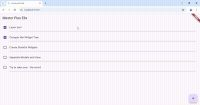
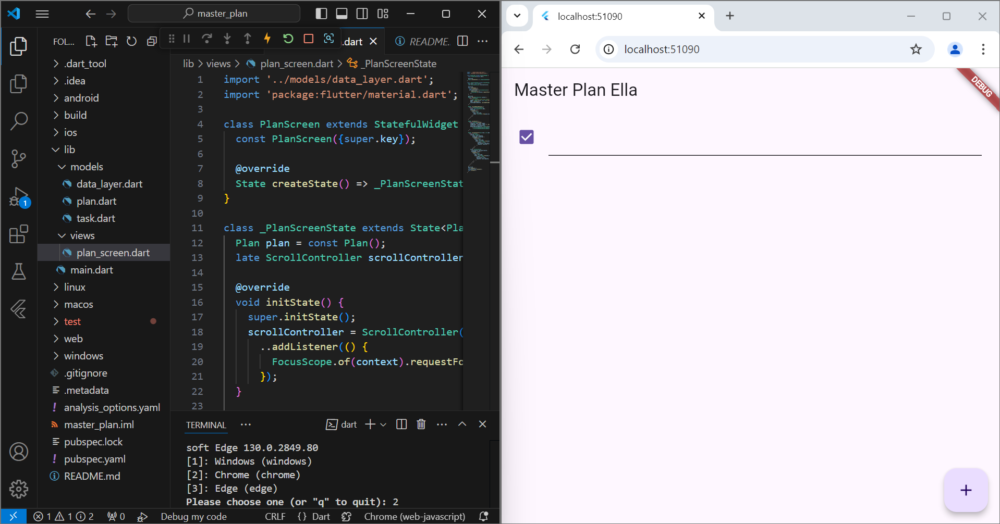

# master_plan
# Ella Dwi Maulina

2. Langkah 4 meminta Anda untuk membuat file data_layer.dart. File ini digunakan untuk menggabungkan beberapa layer data yang sudah ada (seperti plan.dart dan task.dart) ke dalam satu file dengan cara mengekspor kedua model tersebut. Hal ini dilakukan untuk membuat proses impor lebih ringkas seiring aplikasi berkembang, sehingga memudahkan pengelolaan dan penggunaan model data dalam aplikasi.

3. Pada langkah 6, variabel plan dibuat di file plan_screen.dart menggunakan kelas StatefulWidget. Variabel ini berfungsi untuk menyimpan dan menampilkan data rencana yang akan digunakan dalam aplikasi to-do. Variabel ini dibuat sebagai konstanta karena nilainya hanya digunakan sebagai nilai awal atau default yang tidak akan diubah selama aplikasi berjalan, khususnya dalam konteks statis aplikasi.

4. 

5. Pada langkah 11 dan 13, initState() dan dispose() berfungsi untuk mengelola ScrollController selama lifecycle widget. Di initState(), ScrollController dibuat dan disetel agar menghilangkan fokus saat pengguna menggulir. Kemudian, di dispose(), ScrollController dibersihkan untuk mencegah kebocoran memori saat widget tidak lagi digunakan.
